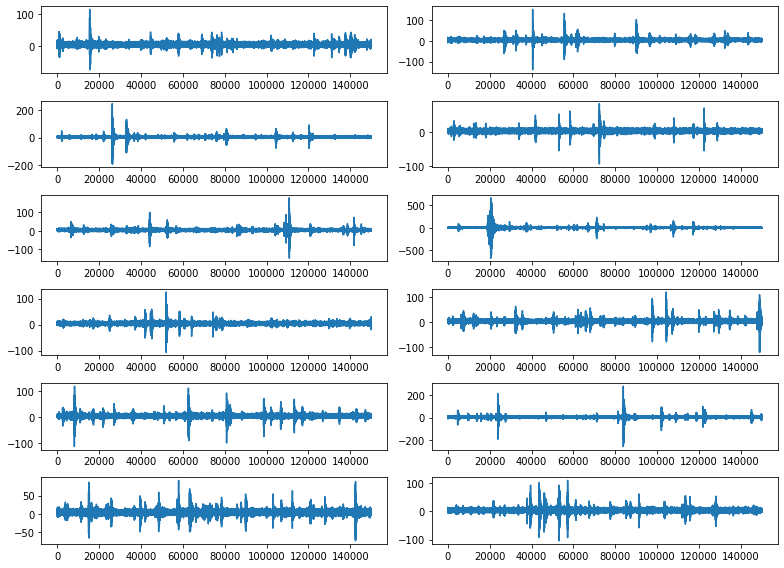
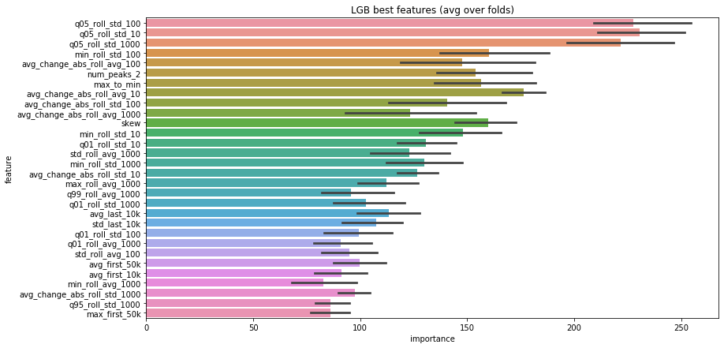
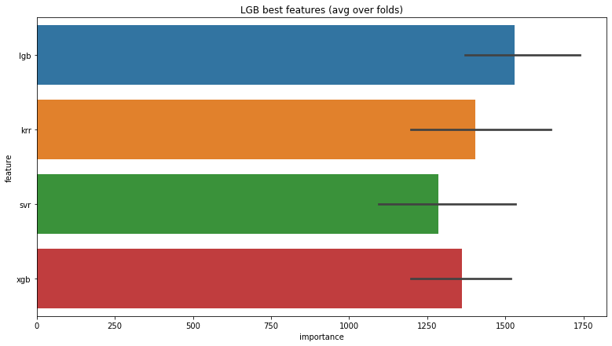

# Kaggle: Earthquake Prediction

Data: 4194 signal segments

Task: predict the time of failure

Evaluation: Mean Absolute Error

Solution: Model stacking (1) LGB, (2) XGB, (3) NuSvr and (4) KRR

Success: 1.538 MAE

