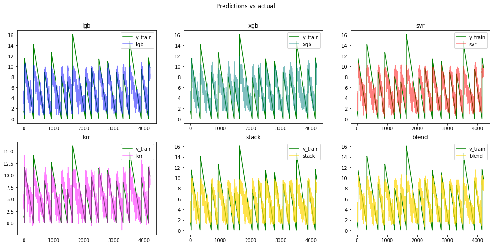

# Kaggle: LANL Earthquake Prediction ([link](https://www.kaggle.com/c/LANL-Earthquake-Prediction/overview))

__Data__: 4194 segments of acoustic signals relating to laboratory earthquakes

__Task__: predict the time to failure (at the end of a segment)

__Evaluation__: Mean Absolute Error

__Solution__: Model stacking LGB, XGB, NuSVR and KRR

__Success__: 1.538 MAE

